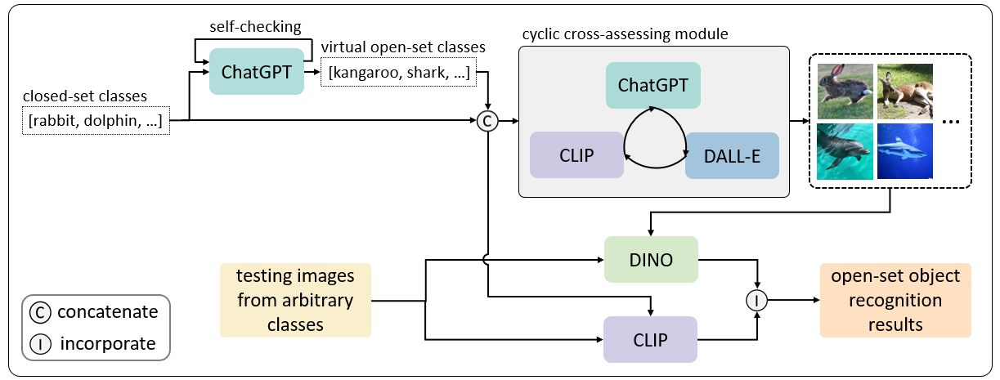

# LMC: Large Model Collaboration with Cross-assessment for Training-Free Open-Set Object Recognition, NeurIPS 2023

<sup>1</sup>Haoxuan Qu\*,
<sup>1</sup>Xiaofei Hui\*,
<sup>2</sup>Yujun Cai,
<sup>1</sup>Jun Liu,

\* equal contribution

<sup>1</sup>Singapore University of Technology and Design, <sup>2</sup>Meta

[[Paper]](https://github.com/Harryqu123/LMC/blob/main/main.pdf) | [[Arxiv]](https://arxiv.org/pdf/2309.12780.pdf) | [[SUTD-VLG Lab]](https://github.com/sutdcv)

## Overview of LMC

<p align="center">  </p>

## Environment

The code is developed and tested under the following environment:

-   Python 3.9
-   PyTorch 2.0.0
-   CUDA 11.7

You can create the environment via:

```
conda create -n lmc python=3.9
conda activate lmc
conda install pytorch==2.0.0 torchvision==0.15.0 torchaudio==2.0.0 pytorch-cuda=11.7 -c pytorch -c nvidia
pip install ftfy regex tqdm scikit-learn scipy pandas six timm
pip install transformers openai
pip install git+https://github.com/openai/CLIP.git
```

## Preparation

### Dataset
Tinyimagenet can be downloaded by running:
```
cd data
bash tinyimagenet.sh
```

### Pre-trained model
To load CLIP pre-trained weights, you can visit official [CLIP](https://github.com/openai/CLIP/) GitHub Repo and download CLIP "ViT-B/32" to `pretrained_model` using download address in [this page](https://github.com/openai/CLIP/blob/main/clip/clip.py). 

To load DINO pre-trained weights, you can visit official [DINOv2]() and download "ViT-B/14 distilled" to `pretrained_model` using download address in [this page](https://github.com/facebookresearch/dinov2#pretrained-models).

## Evaluation 
To evaluate using our provided virtual open-set classes, please unzip `tiny_img.zip` and run:

`python tinyimagenet_eval_msp.py --save_dir path\to\save\result --image_path path\to\unzipped\images`

Note that here we provide virtual open-set classes and generated images that can yield slightly better results than the results provided in our paper for Tinyimagenet.


## Acknowledgement
Part of our code is borrowed from [ZOC](https://github.com/sesmae/ZOC). We thank the authors for releasing the codes.
